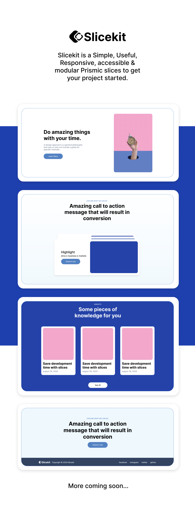
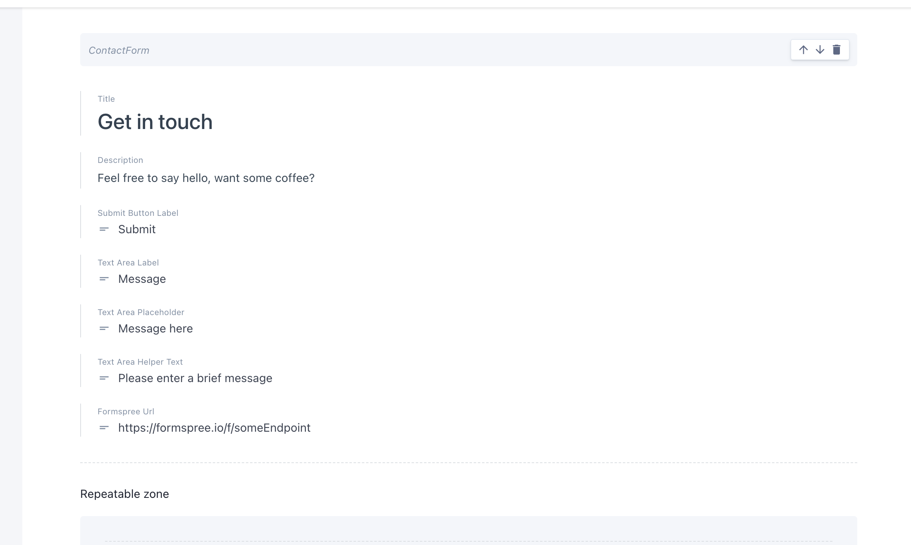
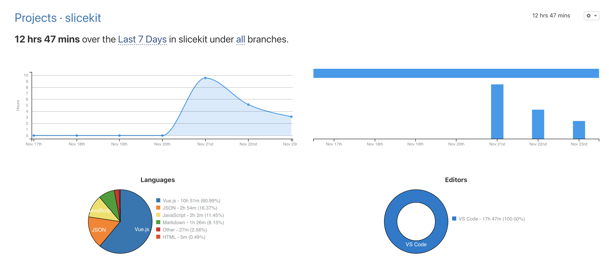

[](https://app.netlify.com/sites/slicekit/deploys)

[slicekit.dev](https://slicekit.dev/)

[Storybook Playground](https://slicekit.dev/playground)

Slicekit is a Simple, Useful & modular Prismic slices to get your project started.

- [👀 &nbsp; Preview](#--preview)
- [📚 &nbsp;Useful Links](#-useful-links)
- [🎨 &nbsp; Designing](#--designing)
- [👩‍💻 &nbsp;Developing](#-developing)
  - [Creating a Slice](#creating-a-slice)
  - [Launching the Slice Builder](#launching-the-slice-builder)
  - [Contact form configuration](#contact-form-configuration)
- [Contest](#contest)
  - [☑️ &nbsp;Submission Checklist](#️-submission-checklist)
  - [🪧 &nbsp; Credits](#--credits)
    - [Technologies used](#technologies-used)
- [Todo](#todo)
- [Time Spent in the project](#time-spent-in-the-project)

## 👀 &nbsp; Preview



## 📚 &nbsp;Useful Links

- [📣 &nbsp;Contest Announcement Blog Post](https://prismic.io/blog/slice-contest?utm_campaign=devexp&utm_source=github&utm_medium=slicecontestpost), check rules and additional information there!
- [🌐 &nbsp;Contest Forum Section](https://community.prismic.io/c/slice-machine/slicecontest), get help and share feedback here~
- [🔪 &nbsp;Slice Machine Documentation](https://www.slicemachine.dev/documentation), to learn more about Slice Machine
- [📖 &nbsp;Prismic Vue.js Documentation](https://prismic.io/docs/vuejs/getting-started/with-the-vuejs-starter), to learn more about Prismic with Vue.js
- [🎨   Slicekit Design Concepts](https://www.figma.com/file/rnLmjTRnV2hhzK9zzTXtl0/Slicekit?node-id=0%3A1), to view Slicekit, slice designs

## 🎨 &nbsp; Designing

Slicekit was designed using [Figma](https://figma.com/), anyone can access the figma file [HERE](https://www.figma.com/file/rnLmjTRnV2hhzK9zzTXtl0/Slicekit?node-id=0%3A1) with viewing permissions. Feel free to reach out if you would like to contribute on the design. Make sure to create a Figma account.

## 👩‍💻 &nbsp;Developing

Some quick reminders to help you developing your library with Slice Machine and the Slice Builder. Please refer to the [documentation](https://www.slicemachine.dev/documentation) if you are looking for more in-depth knowledge.

### Creating a Slice

To create a slice run:

```bash
$ yarn prismic:slice
# The CLI will then guide you through the process...
```

This will create a new directory inside `./slices` named after the provided slice name. Inside it `index.vue` is the slice component itself.

Slices behave just like any regular Nuxt.js component but receives a `slice` prop containing its slice fields. They are run in a Nuxt context meaning that any configuration / module you add to your `nuxt.config.js` file will reflect as expected on those. For example, if you want to use Tailwind CSS, its [setup](https://tailwindcss.nuxtjs.org/setup) remains exactly the same with `@nuxtjs/tailwindcss`.

For comprehensive documentation about creating your own slices check the dedicated [documentation](https://www.slicemachine.dev/documentation/create-your-own-slices-components).

### Launching the Slice Builder

To launch the Slice Builder you need to run 2 terminals: one for Storybook, one for the Slice Builder itself.

```bash
# On a first terminal
$ yarn storybook # or with npm: `$ npm run storybook`

# On the second terminal
$ yarn prismic sm --develop
```

This will launch Storybook on port `3003` and the Slice Builder on port `9999`, you can open a third terminal to create slices from or launch other commands...

For comprehensive documentation about using the Slice Builder check the dedicated [documentation](https://www.slicemachine.dev/documentation/slice-builder#using-the-slice-builder).

### Contact form configuration

The contact form slice, uses [formspree](https://formspree.io/) for its funcitionality. In order to enable form submissions you have to create an account in [formspree](https://formspree.io/register), create a new project, create a new form, and copy the full url provided, example: `https://formspree.io/f/someEndpoint`.

Then add the url on prismic's dashboard:


## Contest

### ☑️ &nbsp;Submission Checklist

To keep track of your progress and to be sure not to miss anything here's a simple checklist you can use. Once everything ticks you should be ready to submit your library to us by tagging [@prismicio](https://twitter.com/prismicio) with #SliceContest on Twitter.

- [x] My library contains at least **5 different slices**
- [x] I have updated the [LICENSE](./LICENSE) to credit myself for my library
- [x] The Storybook documentation is hosted here: <https://slicekit.dev/playground>
- [x] Added a test website preview using slices & prismic here: <https://slicekit.dev/>
- [x] My library does not contain any non-public licensed assets

> ☝️ For comprehensive rules refer to the contest [blog post](https://prismic.io/blog/slice-contest?utm_campaign=devexp&utm_source=github&utm_medium=slicecontestpost).

### 🪧 &nbsp; Credits

Slicekit was designed & developed by [Agnel Nieves](https://github.com/agnelnieves). All design assets and source code is original and it does not contain any non-public licensed assets. The Nuxt-Slicemachine starter codebase was forked from [prismic community](https://github.com/prismicio-community/slice-library-starter-nuxt#readme).

#### Technologies used

- [NuxtJs](https://nuxtjs.org/)
- [Storybook](https://storybook.js.org/)
- [Prismic](https://prismic.io/)
- [SliceMachine](http://slicemachine.dev/)
- [TailwindCss](https://tailwindcss.com/)

## Todo

- [ ] Improve accessibility
- [ ] Improve image performance, lazy loading
- [ ] Add Contact slice
- [ ] Improve SEO

## Time Spent in the project


